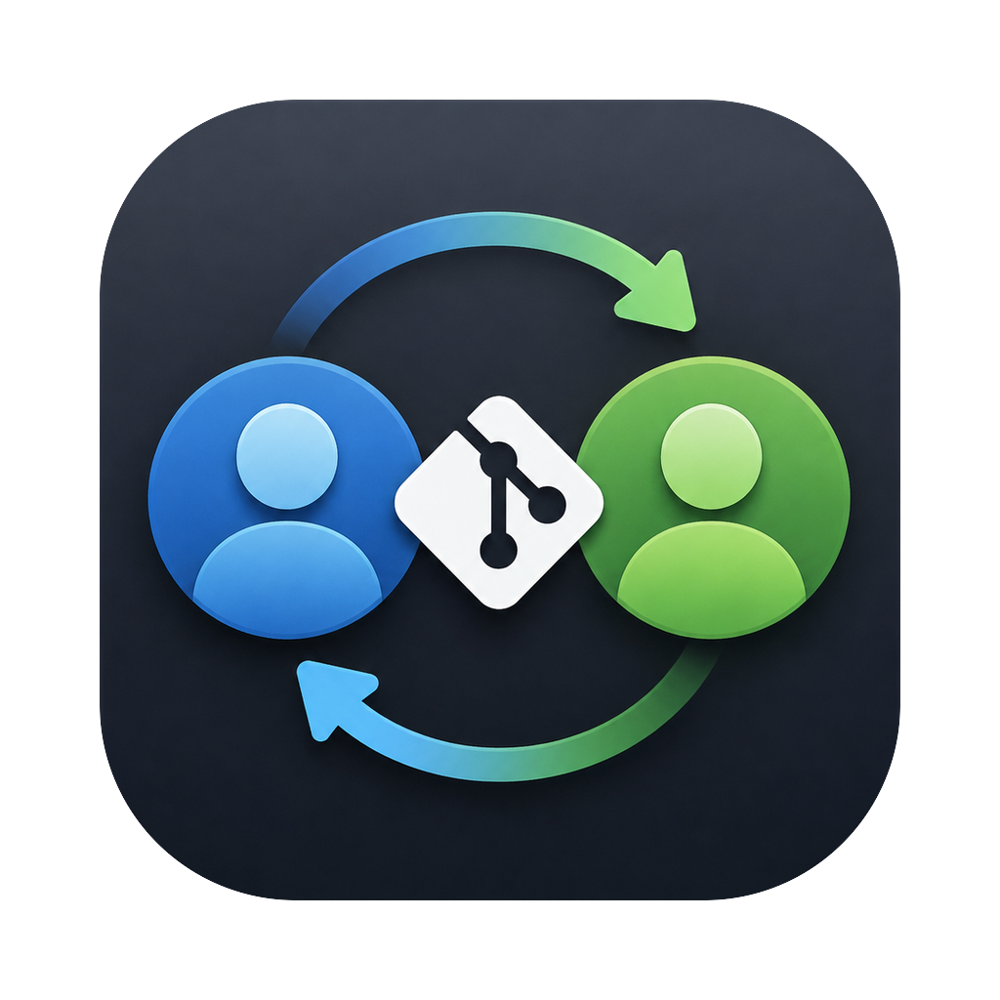

<p align="center">
  
</p>

<h1 align="center">GitSwitch</h1>

A macOS menu bar app for switching between multiple GitHub accounts on one Mac.

**Current version: 1.2.0** · [Changelog](CHANGELOG.md)

The menu bar always shows the active account. Switching does two things in one click:

- runs `gh auth switch`, so `git push` (over HTTPS via the `gh auth git-credential` helper) uses the selected account
- syncs the global git `user.name` / `user.email` to that account's commit identity, so commits are attributed correctly

## Features

- Native light and dark themes, a compact account-switching popover, and a resizable workspace with sidebar navigation
- One-click account switching from the menu bar, with per-account open-PR / review-request / unread-notification counts
- Add any number of GitHub accounts via GitHub's device login flow (the app shows the one-time code, copies it to the clipboard, and opens the browser)
- **Folder rules** — map folders to accounts with git `includeIf` configs, so repos in those folders always commit with the right identity even if you forget to switch
- **Push guard** — a global pre-push hook that blocks pushes to GitHub when the active account doesn't match the repo owner (with org → account mappings; repos' own hooks still run; bypass with `GITSWITCH_SKIP=1 git push`)
- **Repo checker** — drop any repo folder on the Check Repo window to see which account it will push as, which identity it commits with and where that comes from, plus one-click fixes
- **Clone helper** — clone with a chosen account and get the local commit identity (and optionally a folder rule) set in one step
- **SSH panel** — see which GitHub login each `~/.ssh/config` host actually authenticates as, and upload public keys to an account
- Accounts workspace: edit each account's commit name/email, fetch them from the GitHub profile, and sign accounts out; a dedicated Preferences page controls identity sync, menu bar display, and launch at login
- Optional launch at login
- No Electron, no dependencies — a single small SwiftUI binary that drives the `gh` CLI

## Requirements

- Apple silicon Mac running macOS 13+ (the build script targets arm64)
- [GitHub CLI](https://cli.github.com) (`brew install gh`)
- Xcode command line tools (to build)

## Build & install

### Install using a prompt

Copy this prompt into an AI coding assistant that can run terminal commands on your Mac:

```text
Install GitSwitch from https://github.com/pratikaman/GitSwitch on my Mac.

Check that I have an Apple silicon Mac running macOS 13 or later, the GitHub
CLI (gh), and Xcode command line tools. Set up any missing prerequisites,
or explain any system installation steps I need to complete.

Clone the repository into a suitable local folder, or reuse an existing
checkout without overwriting local changes. Read README.md and build.sh,
then run ./build.sh install from the repository directory.

Verify that ~/Applications/GitSwitch.app is installed and running in the
menu bar. Tell me how to connect my first GitHub account. Preserve any
existing GitHub accounts and Git configuration during installation.
```

### Install from Terminal

With the prerequisites installed, run:

```sh
git clone https://github.com/pratikaman/GitSwitch.git
cd GitSwitch
./build.sh install
```

Builds `build/GitSwitch.app` and copies it to `~/Applications`, then launches it.

If you already have a checkout, run `./build.sh install` from that folder. After installation, click GitSwitch in the menu bar and choose **Connect an account** to sign in through GitHub.

## How it works

The account list and active account are read from gh's `~/.config/gh/hosts.yml`. Switching runs `gh auth switch --hostname github.com --user <login>`. Per-account commit identities are stored in the app's `UserDefaults` (`com.pratikaman.gitswitch`) and written to the global git config on switch. Repos with a local `user.email` override, and repos using SSH remotes, are unaffected by switching.
